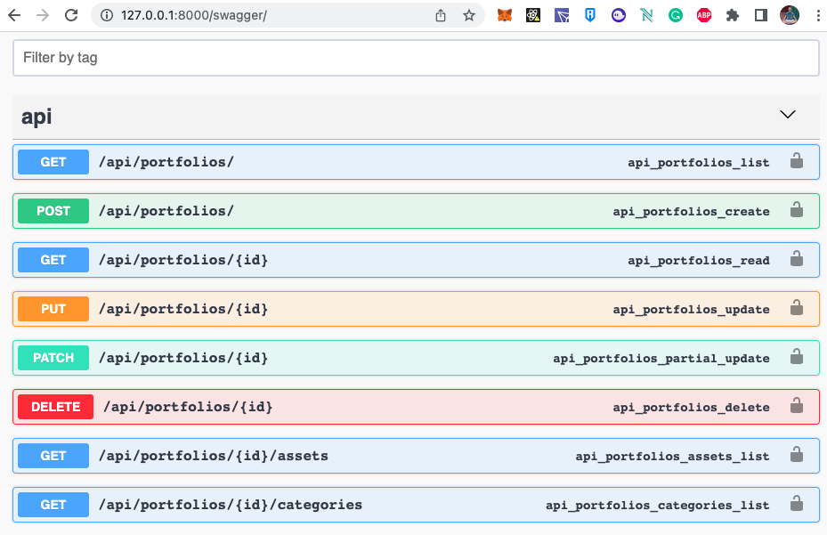

# Django Python Api Backend for Holding and Investments

This project have a backend for holding and investments.

The frontend is in React. That can be accessed by the following link:

https://github.com/diogowernik/react-frontend-holding-and-investments

## How to start

Clone or Fork the repository:

    git clone https://github.com/diogowernik/django-python-backend-holding-and-investments.git backend

Create the python environment:

    python3 -m venv backend_env
    source backend_env/bin/activate
    cd backend
    python3 -m pip install -r requirements.txt

Migrate the database:

    python manage.py migrate

Create the superuser:

    python manage.py createsuperuser

Run the server:

    python manage.py runserver

Go to running application:

    http://localhost:8000/

Login to the admin:

    http://localhost:8000/admin/

## Features and Things to do

This app is not ready, there are some features that are missing. And some features that are working.

### Features that are Working for users on the backend

- Register (Create an account)
- Login
- Logout
- CRUD for Multiple Portfolios (Holdings)

### Features that need to be done for users on the backend

- Permissions (CRUD of the portfolios only for owners and admins)
- CRUD for Investments transaction (Create, Read, Update, Delete) at the moment only read

### Features that are Working for admin

- Admin can CRUD (Create, Read, Update, Delete) Portfolios, Assets, Categories
- Admin can CRUD (Create, Read, Update, Delete) Investments and Transactions
- Transaction automatically creates or updates Portfolios and Assets from Portfolio
- Transaction automatically creates or updates "Tokens" value
- The tokens works as quotes for the investments in the portfolio

### Some screens images of the app

**API for the frontend:**

